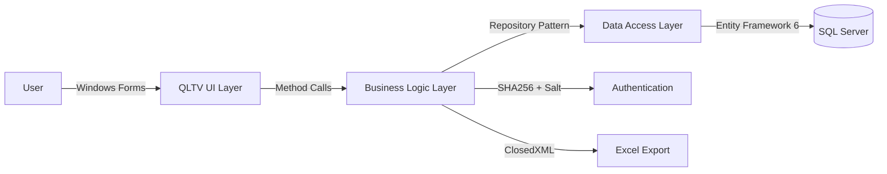
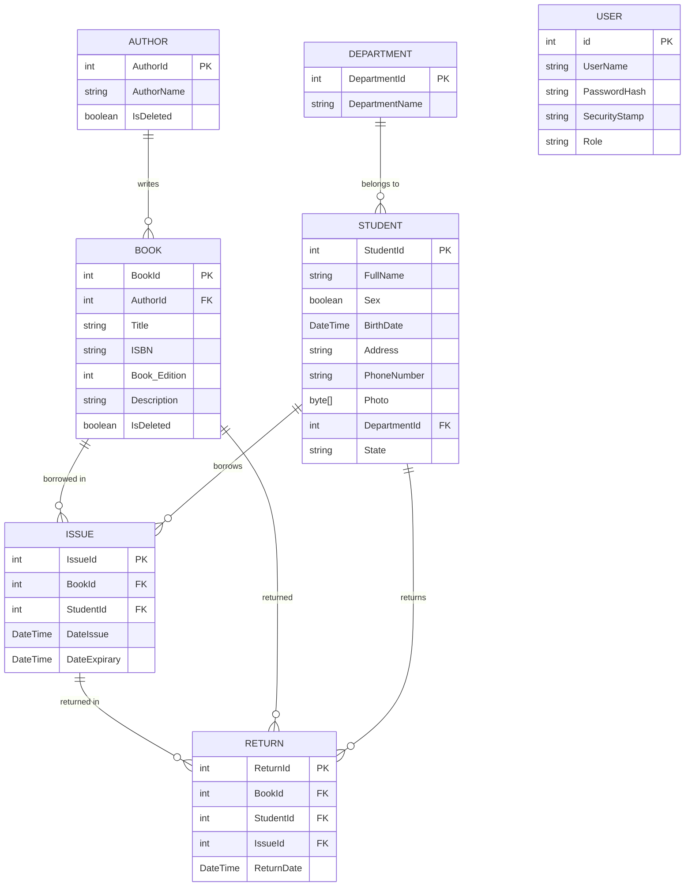

# QLTV — Library Management System

> A C#/.NET Framework 4.8 Windows Forms desktop application for managing a university library, built with Entity Framework 6 and SQL Server.

---

## Overview

QLTV (Quan Ly Thu Vien — "Library Management" in Vietnamese) is a desktop application for managing a university library. It handles book cataloging, author management, student/reader management, book issuing (borrowing), book returning, user account management, and Excel export.

The application follows a classic three-layer architecture (UI → Business Logic → Data Access) and uses Entity Framework 6 Code First with SQL Server.

---

## Features

### Authentication & Authorization
- Login with username and password
- SHA256 password hashing with per-user random salt (24 bytes)
- Role-based access control (Admin, Staff)
- Admin-only features: user generation and user management

### Book Management
- Add, edit, soft-delete, and recover books
- Search by title, book ID, author name, ISBN, or description
- Paginated listing (15 items per page)
- Export to Excel via ClosedXML

### Author Management
- Add, rename, soft-delete, and recover authors
- List all authors in a dropdown for book forms

### Student/Reader Management
- Search by student ID, full name, address, birthday, or department name
- Filter by gender (male/female)
- Paginated listing

### Book Issuing (Borrowing)
- Select book + select student + set dates
- Default expiry: 4 months from issue date
- View all issues with search and pagination

### Book Returning
- Select a student → view their unreturned books → return
- View all returns with search and pagination

### Search
- Real-time search across all major entities (books, students, issues, returns, users)

### Pagination
- All list views use PagedList with 15 items per page

### Excel Export
- Export all books to `.xlsx` using ClosedXML

---

## Tech Stack

### Frontend
- **Framework:** Windows Forms (WinForms)
- **Language:** C# 7+
- **UI:** DataGridView, UserControls, Forms

### Backend
- **Framework:** .NET Framework 4.8
- **Language:** C# 7+
- **ORM:** Entity Framework 6.4.4 (Code First with Fluent API)
- **Database:** SQL Server
- **Provider:** System.Data.SqlClient

### Libraries
- **PagedList 1.17:** Pagination
- **ClosedXML 0.95.4:** Excel export
- **DocumentFormat.OpenXml 2.7.2:** OpenXML support
- **System.Security.Cryptography:** SHA256 hashing, RNGCryptoServiceProvider

### Architecture
- **Pattern:** Three-layer architecture (UI → Business Logic → Data Access)
- **Data Access:** Repository Pattern + Unit of Work
- **Business Logic:** BUS classes with Value Objects (VOs)

---

## Architecture



The application follows a classic three-layer architecture:

1. **UI Layer (QLTV):** Windows Forms with UserControls for layout management
2. **Business Logic Layer (LibraryManagerBussiness):** BUS classes with Value Objects
3. **Data Access Layer (LibraryManagerDataAccess):** Entity Framework 6 with Repository Pattern and Unit of Work

---

## Request Flow

### Authentication Flow

```text
User
  ↓
Enter username & password in LoginForm
  ↓
LoginForm calls UserBUS.Login()
  ↓
UserBUS queries UserRepository
  ↓
UnitOfWork → Repository<User> → LibraryManagerContext
  ↓
Entity Framework 6 → SQL Server
  ↓
Retrieve User with UserName
  ↓
HashComputer.GetPasswordHashAndSalt(password, user.SecurityStamp)
  ↓
SHA256 hash comparison
  ↓
Return (bool success, Role? role)
  ↓
Open MainForm (role-based UI)
```

### Book Issue Flow

```text
Librarian
  ↓
Click "Issue Book" in MainForm
  ↓
IssueBookLayout loads
  ↓
Click "Add Issue" → IssueForm opens
  ↓
Select book (ChooseBookForm) + select student (ChooseStudentForm)
  ↓
Set issue date and expiry date (default: now + 4 months)
  ↓
IssueForm calls IssueBUS.AddIssue()
  ↓
IssueBUS creates Issue entity
  ↓
UnitOfWork → Repository<Issue>.Add()
  ↓
Entity Framework 6 → SQL Server
  ↓
Issue saved
```

---

## Backend Architecture

The application follows a three-layer architecture:

```text
UI Layer (Windows Forms)
    ↓
Business Logic Layer (BUS classes)
    ↓
Data Access Layer (Repository + Unit of Work)
    ↓
Database (SQL Server)
```

### UI Layer (QLTV)
- **Forms:** LoginForm, MainForm, IssueForm, ChooseBookForm, ChooseStudentForm, AddBookForm, EditBookForm, etc.
- **Layouts:** MainLayout, IssueBookLayout, ReturnBookLayout, BookUpdateLayout, GenerateUserLayout, UserListLayout (Singleton pattern)

### Business Logic Layer (LibraryManagerBussiness)
- **UserBUS:** Login, GenerateUser, GetSearchPageList
- **BookBUS:** CRUD, soft-delete, recover, search, pagination
- **AuthorBUS:** CRUD, soft-delete, recover
- **StudentBUS:** GenerateStudent, search, pagination, filter by gender
- **IssueBUS:** AddIssue, search, pagination
- **ReturnBUS:** AddReturnBook, search, pagination
- **DepartmentBUS:** GenerateDepartment

### Data Access Layer (LibraryManagerDataAccess)
- **LibraryManagerContext:** DbContext with DbSets for all entities
- **Repository<T>:** Generic repository with GetAll, Get, Add, Update, Delete, Count
- **UnitOfWork:** Manages DbContext lifecycle and exposes typed repositories
- **Fluent API Maps:** BookMap, AuthorMap, StudentMap, IssueMap, ReturnMap, DepartmentMap

---

## Database Design



---

## API

This is a desktop application and does not expose a REST API.

---

## Authentication & Authorization

```text
User
  ↓
Enter username & password
  ↓
LoginForm → UserBUS.Login()
  ↓
UserRepository.Get(u => u.UserName == username)
  ↓
SQL Server
  ↓
Retrieve User with SecurityStamp (salt)
  ↓
HashComputer.GetPasswordHashAndSalt(password, salt)
  ↓
SHA256 hash comparison
  ↓
Return (success, role)
  ↓
MainForm with role-based UI
```

- **Password Hashing:** SHA256 with per-user random salt (24 bytes via RNGCryptoServiceProvider)
- **Role-Based Access:** Admin and Staff roles
- **Admin-Only Features:** User generation and user management are hidden for Staff users
- **Default Accounts:** `admin`/`123456` (Admin), `user`/`123456` (Staff)

---

## Important Technical Decisions

### Why Three-Layer Architecture?

**Problem:** A desktop application needs clear separation of concerns for maintainability and testability.

**Decision:** Use a three-layer architecture (UI → Business Logic → Data Access).

**Reason:** Separates presentation logic from business rules and data access, making the application easier to maintain and extend.

**Trade-off:** Adds complexity compared to a single-layer approach, but provides better separation of concerns.

### Why Repository Pattern with Unit of Work?

**Problem:** Direct DbContext usage in business logic leads to tight coupling and makes testing difficult.

**Decision:** Use Repository Pattern with Unit of Work to abstract data access.

**Reason:** Provides a clean separation between business logic and data access, enables unit testing with mock repositories, and centralizes DbContext lifecycle management.

**Trade-off:** Adds abstraction layers that may be over-engineered for small applications.

### Why Soft Delete?

**Problem:** Deleting books and authors permanently would lose historical data and break referential integrity.

**Decision:** Use `IsDeleted` boolean flag for books and authors.

**Reason:** Preserves historical data, allows recovery of accidentally deleted items, and maintains referential integrity with issues and returns.

**Trade-off:** Requires filtering deleted items in all queries and adds complexity to the data model.

### Why SHA256 with Salt?

**Problem:** Storing passwords in plaintext or with simple hashing is insecure.

**Decision:** Use SHA256 with per-user random salt (24 bytes).

**Reason:** Prevents rainbow table attacks and ensures that identical passwords produce different hashes.

**Trade-off:** SHA256 is fast, which makes it vulnerable to brute-force attacks. A slower algorithm like bcrypt would be more secure.

---

## Error Handling & Validation

- **Custom Exceptions:** `InvalidAccountAccessException` (login failure), `InvalidAccountRegisterException` (registration failure)
- **Validation:** Password minimum length (6 characters), password confirmation match
- **TransactionScope:** Used in `BookBUS.AddBook()` for atomic transactions (ReadCommitted isolation)

---

## Testing

Testing is currently limited in the MVP and is an area for future improvement.

---

## Docker / Local Development

### Prerequisites
- Windows 10/11
- .NET Framework 4.8
- SQL Server 2016+ (or SQL Server Express)
- Visual Studio 2019/2022

### Database Setup

1. Create a SQL Server database named `library`
2. Update the connection string in `App.config`:

   ```xml
   <connectionStrings>
     <add name="LibraryManagerConnectionString" 
          connectionString="Data Source=localhost;Initial Catalog=library;User ID=sa;Password=your-password" 
          providerName="System.Data.SqlClient" />
   </connectionStrings>
   ```

3. The database will be automatically created and seeded on first run (via `DropCreateDatabaseIfModelChanges`)

### Build & Run

```bash
git clone https://github.com/longdrache/QLTV.git
cd QLTV
```

Open `QLTV.sln` in Visual Studio and run the application.

Or build from command line:

```bash
msbuild QLTV.sln
```

### Default Accounts

| Username | Password | Role |
|----------|----------|------|
| `admin` | `123456` | Admin |
| `user` | `123456` | Staff |

---

## Environment Variables

This application does not use environment variables. Configuration is stored in `App.config`.

---

## Project Structure

```
QLTV/
├── QLTV/                          # UI Layer (Windows Forms)
│   ├── Program.cs                 # Entry point
│   ├── DatabaseInitializer.cs     # EF6 database initializer with seed data
│   ├── Extensions.cs              # Extension methods (ToDataTable, SearchInAllColums)
│   ├── Form/                      # Forms
│   │   ├── LoginForm.cs          # Login screen
│   │   ├── MainForm.cs           # Main application shell
│   │   ├── Issue/                 # Book issuing forms
│   │   ├── Return/                # Book returning forms
│   │   ├── Book/                  # Book management forms
│   │   ├── Author/                # Author management forms
│   │   └── Student/               # Student selection forms
│   ├── Layout/                    # UserControl layouts (Singleton pattern)
│   │   ├── MainLayout.cs          # Home/welcome screen
│   │   ├── IssueBookLayout.cs     # Book issuing panel
│   │   ├── ReturnBookLayout.cs    # Book returning panel
│   │   ├── BookUpdateLayout.cs    # Book management panel
│   │   ├── GenerateUserLayout.cs  # User creation panel (Admin only)
│   │   └── UserListLayout.cs      # User list panel (Admin only)
│   └── Resources/                 # Image assets
│
├── LibraryManagerBussiness/       # Business Logic Layer
│   ├── BookBUS.cs                 # Book business logic
│   ├── AuthorBUS.cs               # Author business logic
│   ├── StudentBUS.cs              # Student business logic
│   ├── IssueBUS.cs                # Issue business logic
│   ├── ReturnBUS.cs               # Return business logic
│   ├── UserBUS.cs                 # User business logic
│   ├── DepartmentBUS.cs           # Department business logic
│   ├── Common/                    # Utilities (HashComputer, SaltGenerator)
│   ├── Exception/                 # Custom exceptions
│   └── VOs/                       # Value Objects
│
└── LibraryManagerDataAccess/      # Data Access Layer
    ├── Context/
    │   └── LibraryManagerContext.cs  # EF6 DbContext
    ├── Models/                    # EF6 entities
    │   ├── Book.cs, Author.cs, Student.cs, Issue.cs, Return.cs,
    │   ├── User.cs, Department.cs, Category.cs, Role.cs, StudentState.cs
    ├── Maps/                      # EF6 Fluent API configurations
    │   ├── BookMap.cs, AuthorMap.cs, StudentMap.cs, IssueMap.cs,
    │   ├── ReturnMap.cs, DepartmentMap.cs
    └── Repositories/
        ├── IRepository.cs         # Generic repository interface
        ├── Repository.cs          # Generic repository implementation
        ├── BookRepository.cs      # Book repository (unused)
        └── UnitOfWork.cs          # Unit of Work pattern
```

---

## Deployment

This is a Windows Forms desktop application. Deployment involves:
1. Building the solution in Visual Studio
2. Distributing the compiled executable
3. Ensuring .NET Framework 4.8 is installed on the target machine
4. Configuring SQL Server connection string

---

## CI/CD

No CI/CD pipeline is configured in the repository.

---

## Challenges & Solutions

### Challenge: Password Security

**Problem:** Storing passwords in plaintext or with simple hashing is insecure.

**Solution:** Implemented SHA256 hashing with per-user random salt (24 bytes) using `RNGCryptoServiceProvider`. Each user has a unique salt stored in the `SecurityStamp` field.

**Trade-off:** SHA256 is fast, making it vulnerable to brute-force attacks. A slower algorithm like bcrypt would be more secure but was not used in this project.

### Challenge: Data Integrity with Deletes

**Problem:** Permanently deleting books and authors would lose historical data and break referential integrity with issues and returns.

**Solution:** Implemented soft delete using an `IsDeleted` boolean flag. Deleted items can be recovered through dedicated forms.

**Trade-off:** Requires filtering deleted items in all queries and adds complexity to the data model.

### Challenge: Transaction Management

**Problem:** Adding a book with its author requires atomic operations to maintain data consistency.

**Solution:** Used `TransactionScope` with `ReadCommitted` isolation level in `BookBUS.AddBook()`.

**Trade-off:** Adds overhead for simple operations but ensures data consistency for complex operations.

---

## What I Learned

- Building a desktop application with C#/.NET Framework 4.8 and Windows Forms
- Implementing a three-layer architecture (UI → Business Logic → Data Access)
- Using Entity Framework 6 Code First with Fluent API for database modeling
- Implementing Repository Pattern and Unit of Work for data access abstraction
- Designing a relational database schema for library management
- Implementing role-based access control and password hashing with salt
- Using ClosedXML for Excel export
- Applying design patterns (Singleton, Repository, Unit of Work)

---

## Future Improvements

- Add student management UI (add, edit, delete students)
- Add reporting and statistics features (charts, dashboards)
- Implement proper password hashing with bcrypt or Argon2
- Add automated tests (unit and integration)
- Migrate to .NET 6+ for cross-platform support
- Add logging and error tracking
- Implement proper authentication with JWT or Identity Framework

---

## Demo

This is a Windows Forms desktop application. No live demo is available.

---

## Resume Summary

- Built a C#/.NET Framework 4.8 Windows Forms desktop application for library management using Entity Framework 6 and SQL Server
- Implemented a three-layer architecture (UI → Business Logic → Data Access) with Repository Pattern and Unit of Work
- Designed a relational database schema with 8 entities (books, authors, students, issues, returns, users, departments) using EF6 Code First
- Implemented role-based access control (Admin/Staff) with SHA256 password hashing and per-user salt
- Added soft-delete functionality for books and authors with recovery support
- Integrated ClosedXML for Excel export and PagedList for pagination
